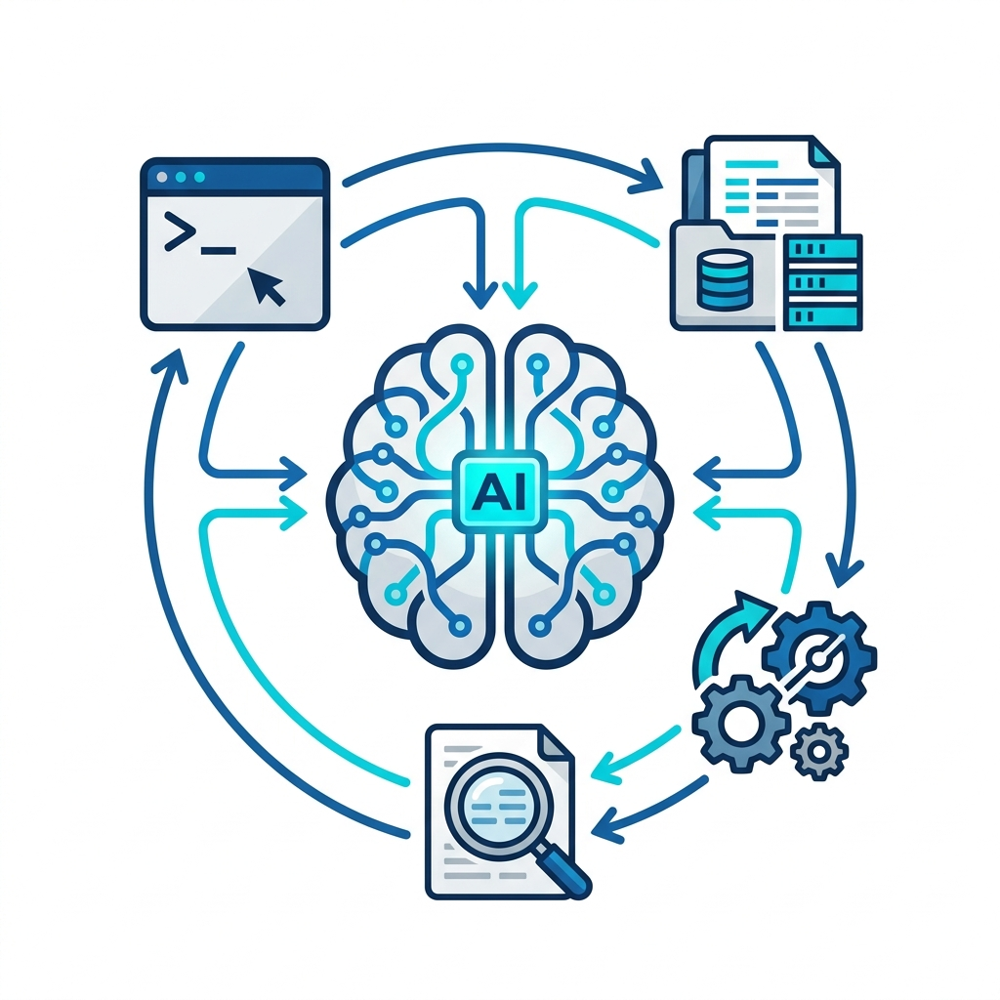

# Chapter 01: What is Agentic AI?

Welcome! If you work with spreadsheets, text files, databases, or documents, you are likely used to using software to format data, find patterns, or write drafts. You may also have used general AI chatbots like ChatGPT or Claude.

This guide is designed to teach you about a much more powerful class of AI: **Agentic AI**, and how to run it completely privately on your own local hardware.

---

## 1. What does "Agentic" Mean?

Most people are familiar with "conversational AI"—you type a question, and the model prints a text response. If you ask it to check a spreadsheet or formatting error, it might explain *how* to do it, but it cannot open the file for you.

An **Agentic AI** (or "Agent") is an AI that has been given **tools** and a **goal**. Instead of just replying to your message, the agent is allowed to interact with its environment: it can read files, write and run scripts, query databases, and inspect its own errors. It runs in a loop until it accomplishes the goal you set.

* **Chatbot (Conversational):** You ask: *"How do I format a date in a Python script?"* The AI explains the code and provides an example.
* **Agent (Agentic):** You ask: *"Read the file `dates_raw.txt`, convert all timestamps to the ISO 8601 format, and save the result to `dates_cleaned.txt`."* The AI writes a Python script, runs it, reads the text data, structures it, writes the cleaned file, and reports back.

---

## 2. The Core Mechanism: Tool Calling



How does an AI call a tool? It is a structured conversation between the AI model and the program running it (the "agent runner" or "harness").

```
┌────────────────────────────────────────────────────────┐
│                        USER                            │
│           "Format the data in raw_data.json"           │
└───────────────────────────┬────────────────────────────┘
                            │
                            ▼
┌────────────────────────────────────────────────────────┐
│                      AI MODEL                          │
│        Generates tool request: "read_file"            │
│         Arguments: {"path": "raw_data.json"}           │
└───────────────────────────┬────────────────────────────┘
                            │
                            ▼
┌────────────────────────────────────────────────────────┐
│                     AGENT HARNESS                      │
│        Sees tool request, reads the file, and          │
│            returns file text to the model              │
└───────────────────────────┬────────────────────────────┘
                            │
                            ▼
┌────────────────────────────────────────────────────────┐
│                      AI MODEL                          │
│        Reads file text and prints the answer           │
└────────────────────────────────────────────────────────┘
```

This loop is called a **Tool-Call Cycle**. The model does not execute code directly; it outputs a structured command saying *"I would like to run this command."* The host system executes it and feeds the results back to the model's memory.

---

## 3. What is a "Local" Model?

Most AI tools run in the cloud, on servers owned by Microsoft, Google, or OpenAI. Every time you ask a question or upload a file, that data is sent over the internet to their datacenters.

A **Local Model** runs entirely on the physical hardware sitting on your desk or in your server rack. No internet connection is required, and no data ever leaves your computer.

---

## 4. The Local Agentic Stack

Running a local agent requires a few components working together. Think of it like a pump station:

1. **The Physical Reservoir (Hardware):** The physical computer chip and RAM. We target the **AMD Strix Halo** APU, which has a shared unified memory pool.
2. **The Piping (GPU Driver):** The software (ROCm or Vulkan) that connects your operating system to the graphics chip, allowing it to perform fast math.
3. **The Engine (Model Server):** A program called `llama-server` (compiled via `llama.cpp`) that loads the model files and serves an API.
4. **The Operator (Agent Harness):** A framework called **Hermes** that manages the agent's thoughts, tools, sandboxes, and loops.
5. **The Task (Your Work):** The data cleaning, verification, or report drafting task you assign.

In the next chapter, we will look at why running this stack locally is particularly vital for data sovereignty and sensitive workflows.
