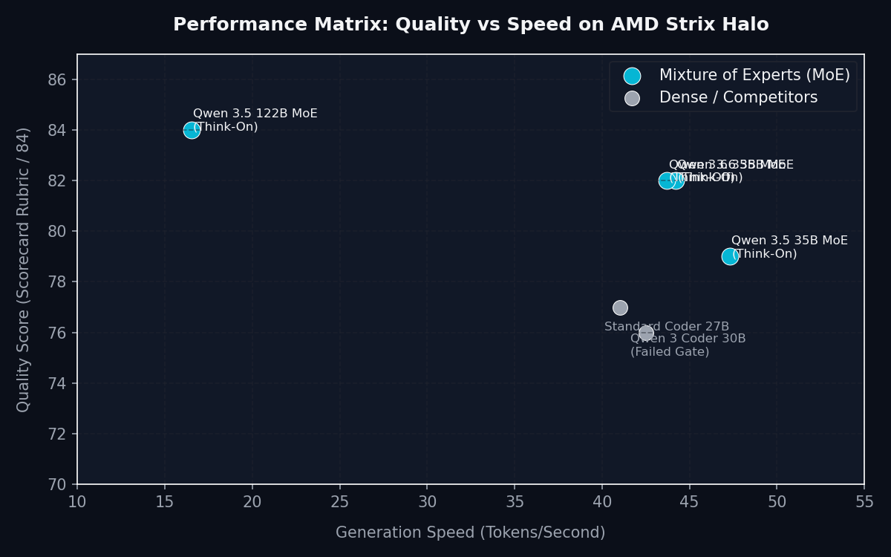

# Chapter 07: Choosing a Model & Benchmark Data

This chapter details the performance benchmarks run on Strix Halo hardware and explains how to select the best model, quantization level, and reasoning configuration.

---

## 1. The Quality vs. Speed Trade-Off

When choosing a model, you must balance its logical capability (Quality Score) against how fast it generates text (Generation Speed). 

Below is the benchmark matrix plotted from our testing runs:



### **Key Takeaways from the Benchmarks:**
1. **The QUALITY Baseline (gpt-oss-120B):** The latest local pairwise tests moved gpt-oss-120B into the general quality tier. It beat Qwen 35B by 5-1 and Qwen 122B by 4-2 on blinded six-prompt comparisons, while decoding at ~46 tokens/second on Vulkan/RADV.
2. **The CODE Baseline (Qwen 3.6 35B):** Qwen 3.6 35B remains the CODE/general baseline because it is fast, compact, and has repeatedly cleared the tool and coding gates. The standard Vulkan/RADV workhorse now measures ~58.5 tokens/second on the reference box. Opt-in MTP lanes raise that to ~72.7 tok/s on MXFP4-MTP and ~81.2 tok/s on Q4_K_M-MTP, while leaving the default setup path unchanged. Community consensus still favors Qwen reasoning in many settings; this guide keeps it in the ladder for exactly that reason.
3. **The Gemma Experiment (Gemma 4 31B):** Gemma 4 31B IT Q6_K is the cross-family coding experiment and second-opinion lane. It cleared nonce and orchestrated coding gates and beat the smaller Gemma 26B-A4B candidate 4-2 in quality pairwise. **Important speed caveat:** Gemma 31B is a dense model — it reads all 31B parameters every token. Measured decode is ~8.25 tok/s tg128 and ~7.7 tok/s sustained on the Vulkan/RADV stack (pp8192 prefill is fast at ~133.6 tok/s). This is much slower than Qwen 35B MoE (~58.5 tok/s workhorse) or gpt-oss-120B (~46 tok/s) because those are Mixture-of-Experts models that activate far fewer parameters per token. Use Gemma 31B for a cross-family second opinion on the orchestrated path, not as a speed-competitive workhorse.
4. **The Qwen 122B Role Change:** Qwen 122B is no longer the default quality target. It remains a spot-specialist for regulatory-currency work and sharp plan review, where it retained its pairwise wins.
5. **The 27B Caveat:** Qwen 3.6 27B has a strong reputation as a reasoner, but local Strix Halo tests did not support making it a default route. It lost 0-6 to Qwen 122B in blind pairwise and normal decode stayed around 9.6-11.5 tokens/second across tested backends.

> [!NOTE]
> **MTP speed lanes are opt-in.** They require Qwen3.6-35B-A3B-MTP GGUFs, a recent llama.cpp build with `--spec-type draft-mtp` support, and current shaderc / `glslc`. The technique surfaced via the community [strix-halo-guide](https://github.com/hogeheer499-commits/strix-halo-guide); this repo independently reproduced and quality-gated the MXFP4-MTP and Q4_K_M-MTP lanes.

---

## 2. Setting the Thinking Toggle

Newer models feature a "Reasoning/Thinking" mode. When enabled, the model prints its step-by-step thinking process inside a special tag before generating the actual response. This is critical for solving coding and multi-step math problems.

However, decoding these thinking tokens takes time. Depending on your task, you can toggle thinking on or off:

### **Case A: Think-On (Recommended for Coding & Agents)**
* **Use case:** Multi-step tool use, code generation, telemetry QA, log parsing.
* **How to run:** Leave the server settings at default. In Hermes, configure a `max_tokens` headroom of 8192, as the thinking process consumes significant output space.
* **Important:** Gemma 4 31B cleared coding on the orchestrated path. If a single long coding episode degrades, split the job into staged steps rather than treating that as a model failure.

### **Case B: Think-Off (Recommended for Fast Data Extraction & Summaries)**
* **Use case:** Checking a single sensor value, extracting text fields, simple status summaries.
* **How to configure:** On current llama.cpp builds (b9247 and later), use the `--reasoning` flag:
  ```bash
  # Preferred: use --reasoning flag (current llama.cpp b9247+)
  serve_rocm.sh --reasoning off
  ```
  This disables the reasoning trace at the server level. For Qwen models using the template-kwarg path on older builds, the legacy form was `--jinja --chat-template-kwargs '{"enable_thinking":false}'` — but that syntax is deprecated and prints warnings on current builds. Prefer `--reasoning off`.

  Disabling thinking saves up to 50% wall-clock time for simple extraction tasks while keeping the tool-calling structure fully functional.

> [!WARNING]
> **Do not use `--reasoning-budget 0` to disable thinking.**  
> Setting `--reasoning-budget 0` is broken on llama-server. It will cause the model to print empty responses or fail tool-calling verification. Use `--reasoning off` instead.
>
> **`--chat-template-kwargs '{"enable_thinking":false}'` is deprecated** in current llama.cpp (b9247+). The server may still accept it but will print deprecation warnings, and on some model+template combinations thinking can still initialize incorrectly. Migrate to `--reasoning off` for all models that support it (Qwen 3.6, Gemma 4, gpt-oss-120B on current builds). If you are running an older pinned build and see issues, check the release notes before updating.

### **Case C: Quality Synthesis**
* **Use case:** Formal reports, planning briefs, multi-document synthesis, and board-facing summaries.
* **Recommended lane:** Use gpt-oss-120B as the general quality baseline, with a system prompt that asks the model to draft with clearly labeled assumptions rather than deflecting into a checklist of missing information.
* **Specialist lane:** Use Qwen 122B when the task depends on regulatory currency or an incisive plan-review voice.

---

## 3. Quick Decision Guide

If you are unsure which configuration to deploy, check the flowchart below:

* Refer to the visual decision guide: [Model Decision Tree](../reference/decision-tree.md)
* For a detailed summary of terms, refer to the [Terminology Glossary](../reference/glossary.md)
* For exact pins, methodology, pairwise tallies, and retained alternatives, see the [Reproducibility Matrix & Technical Deep-Dive](../reference/reproducibility-matrix.md)
