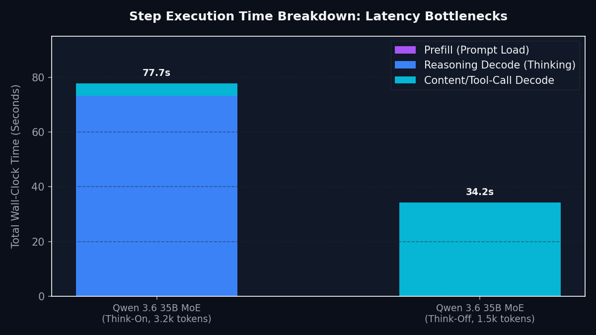

# Chapter 08: Speed and Tuning Optimizations

Once your local model is serving correctly, you can optimize its performance. This chapter covers batch sizes, building the Vulkan backend, and fine-tuning reasoning budgets.

---

## 1. The Reasoning Token Bottleneck

In reasoning models, generating the thinking process consumes most of the execution time. 

The bar chart below breaks down the wall-clock time spent during a single agent step:



As shown, the prefill phase (loading the prompt) and the final content delivery are incredibly fast. The bottleneck is the **Reasoning Decode Phase** (where the model "thinks" before answering). 

To optimize system performance, we target this bottleneck directly.

---

## 2. Setting Reasoning Budgets

Instead of disabling thinking completely, you can cap the number of reasoning tokens the model is allowed to generate per request. This preserves reasoning quality for difficult steps while saving execution time.

### **The Request-Level Lever: `thinking_budget_tokens`**
You can set this parameter directly inside the API request payload (or in your agent's config profile):
```yaml
# Inside your agent settings:
thinking_budget_tokens: 256
```
This forces the model to wrap up its thinking trace and output its final answer once the cap is reached. Because it is configured per-request, your system can automatically adjust budgets:
* **High budget (e.g. 1024):** For drafting a long planning brief or research summary.
* **Low budget (e.g. 128):** For checking sensor logs or formatting simple statuses.

> [!WARNING]
> **Do not cap thinking on stateful, multi-step tasks.** In our testing, *any* budget cap caused the model to drop details it needed to carry between steps and fail the multi-step coding gate — only uncapped thinking held the result. Reasoning budgets are a latency win for single-shot planning and prose, not for chained agent loops. When in doubt, leave it uncapped.

For gpt-oss-120B, the important public-facing rule is simpler: use a system prompt that asks for a draft with clearly labeled assumptions. Before that prompt fix, the model often deflected into a checklist of missing inputs; after it, the same model became the measured AMERICAN-ONLY quality/speed pick (the US-origin lane for agencies that may require domestic-only model provenance).

### **The Global Server Lever: `--reasoning-budget N`**
You can also cap reasoning globally when launching the model server:
```bash
# Set a global cap of 512 tokens per request
serve_vulkan.sh --reasoning-budget 512
```

---

## 3. Vulkan (RADV): the Default Backend (and Why It's Faster)

Vulkan (RADV) is the default serving backend for this stack — it is the `llama-server` you built in [Chapter 05, Step 4](05-setup.md). On AMD APUs the open-source Vulkan/RADV driver runs MoE decoding **+13% to +19% faster** than the ROCm/HIP fallback, with no measured quality loss. This section recaps the build and explains the speedup.

### **How to build llama-server with Vulkan support:**
> The full first-time walkthrough — build prerequisites (`apt install …`) and wiring `TESLA_VULKAN_SERVER` into `scripts/config.env` — is in [Chapter 05, Step 4](05-setup.md). The recap below is just the core build.
```bash
# Clone the llama.cpp project matching the stable release (b9247)
git clone https://github.com/ggerganov/llama.cpp
cd llama.cpp
git checkout b9247

# Build using Vulkan cmake flags
cmake -B build-vulkan -DGGML_VULKAN=ON
cmake --build build-vulkan --config Release --target llama-server
```

### **How to Serve using Vulkan:**
1. Update `scripts/config.env` and set `TESLA_VULKAN_SERVER` to the path of your newly compiled `llama-server` binary.
2. Launch the server using our wrapper:
   ```bash
   bash scripts/serving/serve_vulkan.sh
   ```
This script automatically exports `HIP_VISIBLE_DEVICES=-1` (hiding the GPU from ROCm, forcing Vulkan selection) and sets the ICD to `RADV` (Mesa Vulkan driver). Retesting shows a **+13% to +19% speedup** in token decoding with zero quality loss.

### Decode Speed Reference

All values below are local Strix Halo results from the verified stack. Not universal model rankings. Sorted by decode speed (fastest first); quality lane labels are for routing, not ranking.

For exact artifact sizes, checksums, and missing-instrumentation notes, treat
the [Reproducibility Matrix](../reference/reproducibility-matrix.md) as the
source of truth. This chapter explains the speed levers.

**Verified stack entries:**

| Model | Decode speed | Quality lane |
|---|---:|---|
| Qwen 3.6 35B-A3B Q4_K_M-MTP (Vulkan/RADV) | **~81.2 tok/s** | opt-in speed lane; won quality pairwise 4-2; human-check regulatory figures |
| Qwen 3.6 35B-A3B MXFP4-MTP (Vulkan/RADV) | **~72.7 tok/s** | opt-in speed lane; same production quant |
| Qwen 3.6 35B-A3B MXFP4 (Vulkan/RADV) | **~58.5 tok/s** | CODE/general workhorse (default) |
| Qwen 3.5 35B-A3B MXFP4 (ROCm) | 47.3 tok/s | PLAN/AGENTIC baseline |
| gpt-oss-120B MXFP4 (Vulkan/RADV) | **~46 tok/s** | AMERICAN-ONLY quality/speed (US-origin, OpenAI) |
| Gemma 4 26B-A4B plain control (Vulkan/RADV) | **~44.8 tok/s tg128** | verified plain-control baseline; `pp512 1002.76 ± 10.29 tok/s`, reasoning off, F16 KV |
| Qwen3-Coder-Next UD-Q4_K_XL (Vulkan/RADV) | **44.4 tok/s** | hard-coding challenger; `pp 723.2 tok/s`, Vulkan b9360 promoted |
| Qwen 3.6 35B-A3B MXFP4 (ROCm fallback) | ~44.2 tok/s | CODE baseline ROCm fallback |
| Qwen 3.5 122B-A10B MTP MXFP4_MOE (Vulkan/RADV) | **28.3 tok/s** | *retired 2026-06-02* (tuned lane; `DRAFT_N=1`, `PMIN` unset; 81.8% MTP-probe acceptance; kept as record) |
| StepFun Step-3.7-Flash MTP (Vulkan/RADV) | **27.9 tok/s** (wall std 78.0 s) | QUALITY champion (graduated 2026-06-02); 89.3% MTP acceptance; ub=256 default (ubatch sweep 2026-06-06) |
| StepFun Step-3.7-Flash plain (Vulkan/RADV) | 20.4-22.3 tok/s | QUALITY champion — plain (no-draft) lane |
| Qwen 3.5 122B-A10B MXFP4 (ROCm) | ~19.4 tok/s | *retired 2026-06-02* |
| Qwen 3.6 27B Dense UD-Q4_K_XL | 9.6–11.5 tok/s normal decode | break-glass only |
| **Gemma 4 31B IT Q6_K (Vulkan/RADV)** | **~8.25 tok/s tg128; ~7.7 tok/s sustained** | AMERICAN-ONLY coding second-opinion (dense — see note) |

> [!NOTE]
> **Why is Gemma 4 31B the slowest model in the verified stack?** Both Gemma 31B and Qwen 35B are roughly 25 GB in size, yet Qwen 35B runs roughly 7× faster on the same hardware before any MTP opt-in. The reason is architecture: Qwen 35B is a Mixture-of-Experts model that activates only ~3B parameters per token, so each decode step reads far less weight data from memory. Gemma 31B is a **dense** model: every token requires reading all 31B parameters from the same bandwidth-constrained unified memory. On a memory-bandwidth-bound APU like Strix Halo, that difference collapses decode speed from ~58.5 tok/s (MoE workhorse) to ~8 tok/s (dense). Gemma 31B earns its place in the stack as the AMERICAN-ONLY coding second-opinion lane (US-origin) for quality verification and cross-family comparison — not as a throughput model. Use it on the orchestrated path where quality of each step matters more than wall-clock time.

### **Gemma 4 26B-A4B plain Vulkan control baseline**

The smaller Gemma 26B-A4B lane is now verified on the plain Vulkan/no-spec path with F16 KV and `--reasoning off`. On the reference box it measured `pp512 1002.76 ± 10.29 tok/s` and `tg128 44.76 ± 0.90 tok/s`, with Hermes nonce 3/3. For general reasoning, JSON extraction, and prose, this is the simpler lane: fewer moving parts than MTP, no draft model to manage, and no speculative-drafting flags to keep in sync.

The MTP comparison only pays off on heavy code generation, where the block-size-3 lane reached `63.23 tok/s` on the same box. For JSON/prose it stayed effectively flat versus the plain control lane, so keep the no-spec path as the default.

---

## 4. MTP self-speculative decoding (opt-in speed options)

The Qwen3.6-35B-A3B-MTP GGUFs carry a native `nextn` head. Recent `llama-server` builds can use that head with `--spec-type draft-mtp` to self-speculate, so the model drafts and verifies candidate tokens without loading a separate draft model. The technique surfaced via the community [strix-halo-guide](https://github.com/hogeheer499-commits/strix-halo-guide) by hogeheer499; see the repository acknowledgments for credit and reproduction notes.

This lane needs a recent llama.cpp build (at least the upstream MTP support from PR #22673; we reproduced on tag `b9360`) and a current `glslc`. The distro `glslc` 2023.8 was too old on the reference box; build shaderc from source or use a recent packaged shaderc. Serve with greedy decoding, F16 KV, Flash Attention on, and MTP flags:

```bash
llama-server \
  --spec-type draft-mtp \
  --spec-draft-n-max 2 \
  -ub 1024 \
  --poll 100 \
  -fa on \
  --cache-type-k f16 \
  --cache-type-v f16
```

Measured on the reference Strix Halo box:

| Lane | Decode | vs MXFP4 workhorse (~58.5 t/s) | Quality | Notes |
|---|---:|---:|---|---|
| MXFP4-MTP | ~72.7 t/s | +24% | = production (same quant) | safe default speed lane |
| Q4_K_M-MTP | ~81.2 t/s | +39% | won quality pairwise 4-2 | human-check regulatory figures |

The most aggressive speed-first quant, IQ4_XS-Q8nextn, is the source of the ~101 t/s community headline. It was too aggressive for this repo's quality bar: in our blind pairwise it lost 0-6 against the production model, so we did not ship it as a recommended lane. That is not a defect in the community work; the guide explicitly frames IQ4_XS as a speed-first quant. For water-treatment and regulatory work, the durable win is MTP itself, applied to quants that hold quality.

One build caveat matters: simply updating llama.cpp did not speed up our MXFP4 model. A clean A/B was a wash because integer-dot shader acceleration does not apply to MXFP4's FP4 format. MTP is the lever, not the build bump.

---

## 5. Tuning Batch Sizes

The server's logical batch size (`--batch-size`) and physical micro-batch size (`--ubatch-size`) control how prompt segments are loaded into memory.
* For Strix Halo APUs, keep both set to **`2048`**.
* *Why:* Setting these values higher consumes excessive unified graphics memory, which can lead to system hangs. Setting them lower slows down the prefill phase (loading long prompts).
