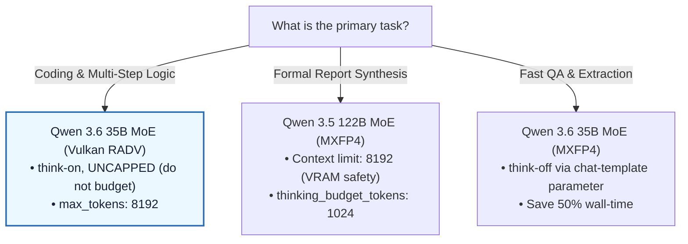

# Model Decision Tree

Use this flowchart to select the optimal model, quantization, and reasoning settings on the 128 GB (96 GB GTT) baseline system based on your task priority:

---

### Key Takeaway for Strix Halo (APU)
* **MoE Models** (35B and 122B) run incredibly fast and behave intelligently but consume significant memory mapping tables. They are fully supported and recommended on the 128 GB system memory baseline.
* **Reasoning budgets are a *planning* lever, not a coding one.** Capping `thinking_budget_tokens` cuts wall-clock on prose/planning, but a budget sweep showed *any* cap drops the stateful coding gate to 1–2/3 (only uncapped think-on holds 3/3). Leave the coding route uncapped.

