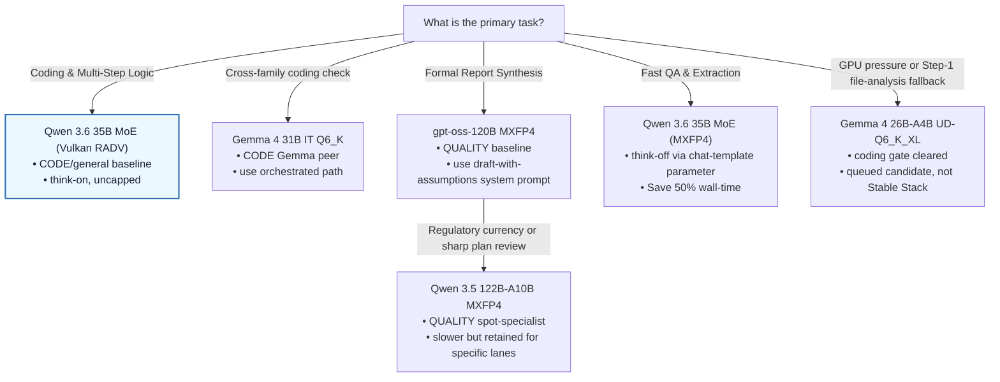

# Model Decision Tree

Use this flowchart to select the optimal model, quantization, and reasoning settings on the 128 GB (96 GB GTT) baseline system based on your task priority:

---

### Key Takeaway for Strix Halo (APU)
* **Measured local gates now set the ladder.** Qwen remains a strong reasoning family and stays available, but the 2026-05-30 Strix Halo results promote gpt-oss-120B as the general QUALITY baseline and Gemma 4 31B as a cross-family CODE peer.
* **Qwen 122B is no longer the default quality target.** It stays useful as a spot-specialist for regulatory-currency tasks and incisive plan review.
* **Gemma 26B-A4B is queued, not graduated.** It cleared the coding gate and has a narrow file-analysis niche, but Gemma 31B was faster and won the quality pairwise 4-2.
* **Reasoning budgets are a *planning* lever, not a coding one.** Capping `thinking_budget_tokens` cuts wall-clock on prose/planning, but a budget sweep showed *any* cap drops the stateful coding gate to 1–2/3 (only uncapped think-on holds 3/3). Leave the coding route uncapped.
