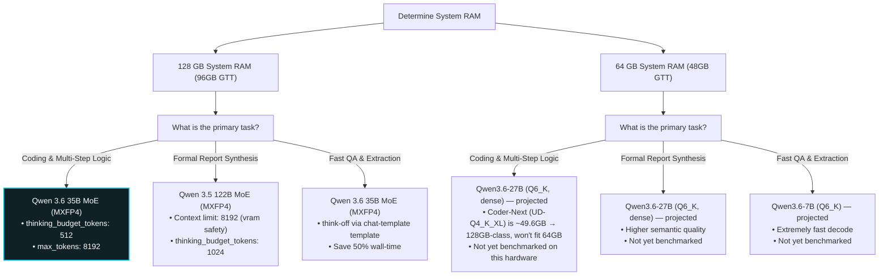

# Model Decision Tree

Use this flowchart to select the optimal model, quantization, and reasoning settings based on your system RAM size and task priority:

---

### Key Takeaway for Strix Halo (APU)
* **MoE Models** (35B and 122B) run incredibly fast and behave intelligently but consume significant memory mapping tables. They should **only** be run on 128 GB systems.
* **Dense Models** (7B and 27B) should be used on 64 GB setups to preserve context memory buffers and prevent graphics crashes.
