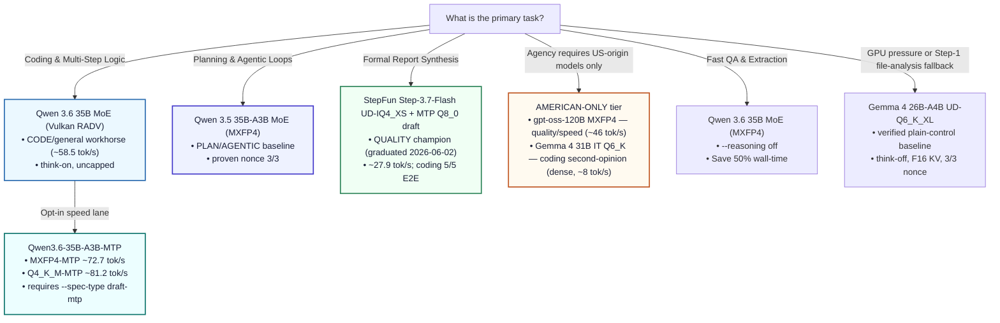

# Model Decision Tree

Use this flowchart to select the optimal model, quantization, and reasoning settings on the 128 GB (96 GB GTT) baseline system based on your task priority:

The tree is a routing aid, not a universal leaderboard. It reflects this repo's
measured local gates for a water/utility agent workflow: tool discipline,
coding reliability, report quality, speed, and reproducibility.

---

### Key Takeaway for Strix Halo (APU)
* **Measured local gates set the ladder.** Qwen 3.6 35B is the CODE/general workhorse and Qwen 3.5 35B is the PLAN/AGENTIC baseline. As of the 2026-06-02 stable set, **StepFun Step-3.7-Flash graduated as the QUALITY champion** for formal synthesis (it replaced Qwen 122B at the same decode speed with higher quality).
* **The AMERICAN-ONLY tier is for agencies that may require US-origin models.** Because the champion (StepFun) and the Qwen workhorses are non-US in origin, this tier names the domestic-origin picks: **gpt-oss-120B** (OpenAI) for quality/speed and **Gemma 4 31B** (Google) as the coding second-opinion (dense — ~8 tok/s decode; use on the orchestrated path, not as a throughput pick).
* **Qwen 3.5 122B is retired** (2026-06-02). StepFun covers the quality role it used to hold.
* **MTP speed lanes are opt-in.** Qwen3.6-35B-A3B-MTP keeps the Qwen workhorse role but requires the MTP GGUFs, a recent llama.cpp build, and current shaderc / `glslc`.
* **Gemma 26B-A4B is a verified plain-control baseline, not a queued candidate.** It keeps a narrow file-analysis / memory-pressure niche, measured and reproducible at ~44.8 tok/s tg128 with F16 KV and reasoning off.
* **Reasoning budgets are a *planning* lever, not a coding one.** Capping `thinking_budget_tokens` cuts wall-clock on prose/planning, but a budget sweep showed *any* cap drops the stateful coding gate to 1–2/3 (only uncapped think-on holds 3/3). Leave the coding route uncapped.
