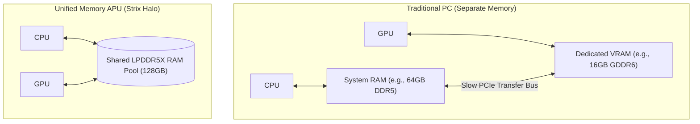
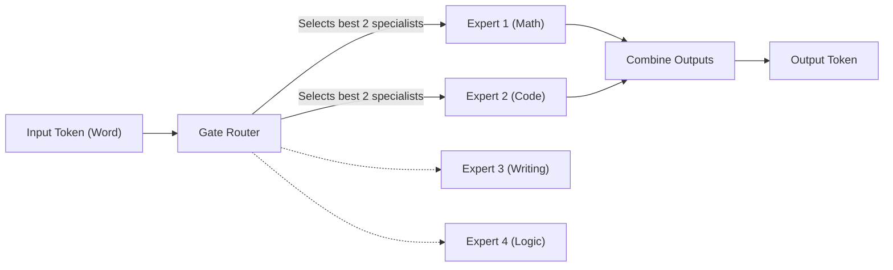

# Glossary of Terms (tesla_agent)

This glossary explains the hardware, drivers, machine learning, and agentic concepts used in this repository. All explanations are written in **ELI5 (Explain Like I'm 5)** style with real-world analogies, logical groupings, visual diagrams, and links to canonical reference materials.

---

## 🔌 Group 1: Hardware & Memory Architecture

These terms cover the physical computer parts and drivers that make running local AI possible.

### **APU (Accelerated Processing Unit)**
* **ELI5 Explanation:** A single computer chip that contains both the main CPU (the "manager") and the GPU (the "math speed-runner").
* **Analogy:** Instead of buying a separate stove and blender, an APU is like a premium kitchen machine that does both tasks on the same counter.
* **External Reference:** [AMD APU Technology Overview](https://www.amd.com/)

### **UMA (Unified Memory Architecture)**
* **ELI5 Explanation:** A memory design where the CPU and GPU share the exact same physical system RAM pool instead of having separate memory pools.
* **Analogy:** Imagine a kitchen where the chef (CPU) and assistant (GPU) share a single massive counter space instead of running back and forth to separate tables. This lets the GPU load massive AI models directly into system memory.
* **External Reference:** For a deep dive on how memory architectures affect ML, see the [Google ML Glossary: Hardware Accelerators](https://developers.google.com/machine-learning/glossary#hardware-accelerators).

### **GTT Size (Graphics Translation Table)**
* **ELI5 Explanation:** A setting in your operating system that decides how much shared system RAM the GPU is allowed to allocate.
* **Analogy:** A boundary line in a shared room. If you have a huge 128 GB house, but the line restricts the GPU to a tiny 16 GB closet, the GPU won't be able to open its huge model boxes. You must slide the boundary line up (e.g., to 96 GB) to let the GPU breathe.

### **ROCm (Radeon Open Compute)**
* **ELI5 Explanation:** AMD's software platform that translates AI mathematical commands into instructions AMD graphics chips can understand.
* **Analogy:** A bilingual translator. ROCm is the AMD equivalent to NVIDIA's CUDA, taking standard AI commands and translating them for the Radeon GPU.
* **External Reference:** [AMD ROCm Documentation Portal](https://rocm.docs.amd.com/)

### **Vulkan & Mesa RADV**
* **ELI5 Explanation:** An open-source graphics library (Vulkan) and driver (RADV) developed by the community. It acts as an alternative pipeline to ROCm.
* **Analogy:** A bypass road. Sometimes, taking the Vulkan road runs +15% faster for reading model files than using the official ROCm highway on Strix Halo hardware.

---

## 🧠 Group 2: Machine Learning & LLM Core

These terms explain how the AI model's "brain" represents data and handles memory.

### **LLM (Large Language Model)**
* **ELI5 Explanation:** A massive autocomplete brain trained on billions of sentences to predict the most likely next word.
* **Analogy:** A hyper-advanced version of your phone's predictive text keyboard, but it has read the entire internet.
* **External Reference:** [Google ML Glossary: Large Language Model](https://developers.google.com/machine-learning/glossary#large-language-model)

### **Tokens**
* **ELI5 Explanation:** Tiny pieces of words that the AI reads and writes. A token is usually 3 to 4 characters (e.g., the word `antigravity` is split into `anti` + `gravity`).
* **Analogy:** Instead of reading full words or single letters, the AI cuts text into syllable blocks, like Lego bricks, to build sentences.
* **External Reference:** [Google ML Glossary: Token](https://developers.google.com/machine-learning/glossary#token)

### **Context Window (Context Size)**
* **ELI5 Explanation:** The size of the AI's active notebook page. It is the maximum amount of text (prompts plus answers) the AI can hold in its short-term memory at one time.
* **Analogy:** A notepad. A 32,768 token context window means the AI has a huge notebook to write down everything you said and everything it did, ensuring it doesn't forget how the conversation started.
* **External Reference:** [Hugging Face LLM Concepts Guide](https://huggingface.co/docs/transformers/index)

### **Flash Attention**
* **ELI5 Explanation:** A mathematical speed-reading trick that prevents the AI from slowing down to a crawl when its notebook page gets full of text.
* **Analogy:** Instead of reading a 100-page book line-by-line over and over to find a name, the AI makes index cards of key points so it can recall details in a millisecond.

### **Speculative Decoding**
* **ELI5 Explanation:** An AI acceleration technique where a tiny, fast model guesses the next words, and a large, smart model checks them in batches.
* **Analogy:** A junior assistant drafting an email quickly, and a senior editor reviewing it in 5-second passes. If the assistant guessed right, we save time; if wrong, the editor rewrites that sentence.

---

## 🗜️ Group 3: Model Formats & Compression

These terms cover how massive models are shrunk and packaged so they can fit inside consumer computers.

### **GGUF (GPT-Generated Unified Format)**
* **ELI5 Explanation:** A single-file package format designed to make loading and running AI models easy on standard consumer laptops and desktops.
* **Analogy:** A `.zip` or `.mp3` file specifically for AI weights, containing everything needed to run in a single download.

### **Quantization**
* **ELI5 Explanation:** A compression technique that reduces the precision of model weights (e.g., from 16-bit decimals to 4-bit integers) to shrink the model file size.
* **Analogy:** Taking a high-resolution, uncompressed photo and saving it as a neat JPEG. It takes up 70% less hard drive space, but it looks virtually identical to the human eye.
* **External Reference:** [Google ML Glossary: Quantization](https://developers.google.com/machine-learning/glossary#quantization)

### **Mixture-of-Experts (MoE)**
* **ELI5 Explanation:** A model architecture where only a few parts of the brain ("experts") are active for any given word, while the rest stay asleep.
* **Analogy:** A hospital with 8 specialist doctors. Instead of all 8 doctors treating you at once for a simple headache, the router sends only the 2 required specialists. It is much faster and cheaper, but you still get expert care.

### **MXFP4 (Microscaling Format 4-bit)**
* **ELI5 Explanation:** An advanced 4-bit compression standard supported directly by hardware accelerators (like Strix Halo) that packages weights into tiny microscaled blocks.
* **Analogy:** A high-compression shipping crate layout that matches the factory forklift's dimensions exactly, allowing fast unloading.

---

## 🤖 Group 4: Agentic Workflows & Loops

These terms cover how AI goes from a conversational chatter to an active workspace tool that does work.

### **Agent (Agentic AI)**
* **ELI5 Explanation:** A chatbot that has been given **tools** (like running code or reading files) and a **goal**. It plans, executes commands, reads results, and corrects its own errors until the job is done.
* **Analogy:** A standard chatbot is like a phone advisor who tells you how to fix your computer. An agent is like a digital technician you give a mouse and keyboard to, saying: "Go fix this file and let me know when you're finished."

### **Tool Call**
* **ELI5 Explanation:** The moment the AI model decides to use an external program (like a calculator or python runner) instead of guessing.
* **Analogy:** A chef saying "I need to look up this recipe in the index" or "I need to use the scale to weigh this flour," rather than guessing the weights in their head.

### **Nonce Gate**
* **ELI5 Explanation:** A security-check game used to verify that an agent is actually running code in its sandbox rather than fabricating answers.
* **Analogy:** A physical key-check. We hide a secret random word (the nonce) inside a box, and tell the agent to open the box and read it. If the agent repeats the exact word back to us, we know they actually opened the box instead of guessing.
